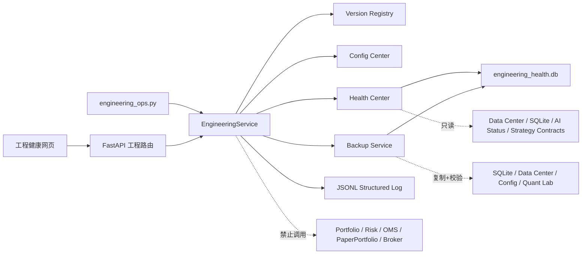

# PANGU V3.1 工程稳定化架构

## 1. 边界

工程稳定化层只处理版本、配置、日志、健康、备份与 CI。它不拥有股票评分、因子、ResearchPipeline、组合、风控、模拟成交或券商接口。



## 2. 版本中心

入口为 `src/pangu/version/registry.py`。`VersionManifest` 聚合：

- 系统版本 `3.1.0`；
- API 版本 `1.1.0`；
- 工程版本 `engineering-stabilization-v1.0.0`；
- 生产策略 `cross-sectional-v2.0.0`；
- 生产因子 `cross-sectional-v1.0.0`；
- Data Center、配置、工程数据库与备份 Manifest Schema；
- AI Copilot、AI Quant Research 和模型接口版本。

版本清单使用规范 JSON 生成 SHA-256。受保护生产模块继续保存自己的常量；CI 通过漂移测试把它们与版本中心绑定，避免为统一版本而修改业务核心。

## 3. 配置中心

配置加载顺序：

```text
base.yaml
  → strategy.yaml
  → risk.yaml
  → ai.yaml
  → scheduler.yaml
  → development.yaml / production.yaml
  → PANGU__SECTION__KEY 环境变量覆盖
  → 安全校验
  → 脱敏快照 + config_hash
```

旧 `config/settings.yaml` 保留为现有业务配置源，避免大爆炸迁移。新配置中心不改变其参数，也不会把工程配置写回业务配置。`PANGU_ENV` 只允许 `development` 或 `production`；两种环境均强制 `live_trading_enabled=false` 与 `allow_live_broker=false`。

环境覆盖示例：

```powershell
$env:PANGU__ENGINEERING__LOG_LEVEL = "WARNING"
.venv\Scripts\python.exe engineering_ops.py status
```

敏感名称不能通过 `PANGU__...` 进入快照；DeepSeek 与同花顺 Key 仍只从既有专用环境变量读取。

## 4. 结构化日志

固定 JSON 字段：

```json
{
  "timestamp": "UTC ISO-8601",
  "level": "INFO",
  "module": "health_center",
  "event": "engineering_health_evaluated",
  "run_id": null,
  "user_id": null,
  "trace_id": "uuid",
  "message": "工程健康检查完成",
  "extra": {}
}
```

日志文件为 `output/logs/pangu-engineering.jsonl`，5 MB 轮转、保留 5 份；相同事件写入 `system_events`。键名含 API Key、密码、Secret、Token、Authorization 或 Credential 时强制脱敏；消息中的 `sk-*` 值也会替换。

## 5. 健康中心

四维固定权重：数据 30、数据库 30、AI 20、策略 20。缺少维度不重新分权。

| 维度 | 只读证据 | 失败语义 |
|---|---|---|
| Data | Data Center catalog、latest 指针、研究运行数量 | 目录缺失降级；完整性异常为不健康 |
| Database | `output` 内 SQLite `PRAGMA quick_check` | 任一失败按比例扣分 |
| AI | 注入的脱敏 `ModelService.status()` | 未配置作为可选依赖降级；异常隔离 |
| Strategy | 生产策略/因子运行时常量与版本中心、最新研究快照 | 版本漂移立即不健康 |

总分 `>=85` 为 `HEALTHY`、`>=60` 为 `DEGRADED`，否则为 `UNHEALTHY`。结果写入 `health_checks`，但不会自动修改策略、配置或投资状态。

## 6. 工程数据库

`output/engineering_health.db` 使用 WAL、外键与 10 秒 busy timeout：

- `system_events`：结构化事件、trace、扩展证据；
- `health_checks`：四维快照、分数、证据哈希；
- `backups`：开始/完成时间、终态、路径、Manifest 哈希、文件/字节数和失败原因。

三表在数据库层用 `CHECK` 强制 `can_trade=0`、`can_create_orders=0`。

## 7. 备份

备份目录：`output/backups/YYYY-MM-DD/backup-.../`。每次生成唯一目录，不覆盖历史。

范围：

- `config/*.yaml`；
- `output` 内 SQLite 数据库（使用 SQLite Online Backup API）；
- `output/data_center`；
- `output/quant_lab`。

排除：`.env*`、credentials、日志、既有 backup 目录。`manifest.json` 保存文件相对路径、大小和 SHA-256，并绑定完整版本清单。发布前、Windows 兼容复制后均重新校验。

手工命令：

```powershell
.venv\Scripts\python.exe engineering_ops.py health
.venv\Scripts\python.exe engineering_ops.py backup
```

交付不会自动安装计划任务；生产调度启用前应由用户明确决定保留周期和磁盘预算。

## 8. API 与网页

新增 7 个桌面本机 API：

- `GET /api/v1/engineering`
- `GET /api/v1/engineering/versions`
- `GET /api/v1/engineering/config`
- `GET /api/v1/engineering/events`
- `GET /api/v1/engineering/backups`
- `POST /api/v1/engineering/health/run`
- `POST /api/v1/engineering/backups`

写操作继续要求 `X-Ashare-Client: local-dashboard` 并受 Origin 校验；远程移动端不能访问。网页只调用 `web/generated/client.js` 中的 operationId，没有手写 API 路径。

## 9. 测试与 CI

四层门禁：

1. Unit：版本、配置、脱敏、数据库约束；
2. Integration：健康聚合、备份复制/校验、API 本机写保护；
3. Regression：生产策略/因子版本一致、受保护文件哈希不变、无交易依赖；
4. Health：真实 SQLite quick-check、OpenAPI 客户端同步、安全扫描。

GitHub Actions 在 Windows + Python 3.11 上执行依赖安装、compileall、工程/安全扫描、OpenAPI 同步差异检查、全量 pytest，并上传 JUnit 报告。

## 10. 已知限制

- 当前为单机 SQLite，不支持多进程分布式健康锁和远程备份仓库。
- 备份已验证可恢复所需文件与哈希，但本阶段不提供一键覆盖式恢复，避免误删当前数据。
- AI 健康默认读取本地状态，不主动发起收费或联网探测。
- 旧业务配置仍在 `settings.yaml`；迁移采用兼容双轨，后续应逐模块、逐测试切换，而不是本阶段强制重写。
