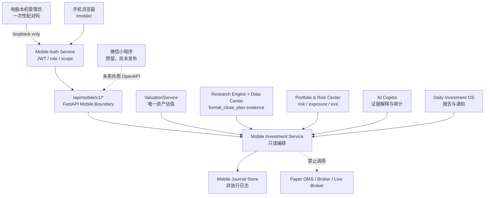

# Pangu V2 Mobile Investment Assistant

## 1. 定位

PANGU-V2-007 为盘古·天机增加移动 Web 入口，并为后续微信小程序保留同一套 API 合同。它是个人投资研究、组合风险、AI 证据解释、运营报告和投资日志的移动入口，不是交易终端。

移动端的能力上限固定为：

```text
can_trade = false
can_create_orders = false
can_modify_strategy = false
can_modify_portfolio = false
can_modify_risk = false
can_access_broker_credentials = false
```

这些限制同时存在于响应 DTO、服务返回、数据库 CHECK、移动页面和 API 权限边界中。移动端既不能创建实盘订单，也不能创建模拟订单。

## 2. 架构



移动页面只通过 OpenAPI 生成的 `web/generated/client.js` 调用接口。页面没有手写 API 路径，也不计算现金、市值、权益、PnL、回撤、仓位或风险分数。

## 3. 页面

| 页面 | 内容 | 数据边界 |
|---|---|---|
| 投资驾驶舱 | 权益、今日收益、仓位、风险、研究池状态、Top 机会、AI 摘要 | 估值来自 ValuationService；机会只来自正式收盘 run |
| 我的组合 | 持仓、累计盈亏、风险、行业暴露、退出证据 | 不生成调仓或订单 |
| 股票研究 | 排名、因子、风险、目标仓位、持仓、退出条件、既有 AI 报告 | 必须绑定 `formal_close_plan` run_id；禁止盘中 preview 回退 |
| 天机助手 | 股票、组合、风险和复盘四类有界问答 | 使用现有 Evidence Reader/Copilot 报告类型；GET 不调用模型 |
| 投资报告 | 晨报、盘中监控、收盘复盘、周报 | 只读取 Daily Investment OS 已保存报告 |
| 通知中心 | INFO/WARNING/CRITICAL 与已读状态 | 只读列表；admin 可标记已读 |
| 投资日志 | 买入理由、卖出理由、复盘和观察记录 | 与策略、组合和交易账本隔离 |

Market Regime 只有在上游存在正式点时证据时才显示。当前没有该证据时，页面只显示“研究池状态”，不会推断牛市、震荡或熊市。

## 4. 身份与配对

### 4.1 启动边界

默认 `server.py` 仍只监听 `127.0.0.1`，不会开放手机访问。只有显式运行：

```powershell
.venv\Scripts\python.exe server.py --mobile --port 8765
```

或双击 `启动移动助手.cmd`，服务才监听局域网。

### 4.2 配对流程

```text
电脑本机 /mobile/
  → 本机管理员生成 8 位一次性配对码
  → 服务端只在内存保存加盐 HMAC，不保存明文
  → 手机输入配对码和设备名
  → 换取有限时 HS256 JWT
  → JWT 只保存在手机浏览器 sessionStorage
```

配对码默认 5 分钟有效、单次使用、最多 5 次尝试。签发令牌包含 `iss`、`aud`、`iat`、`nbf`、`exp`、`jti`、`role`、`device_id` 和固定 scopes。

角色：

- `viewer`：只读页面、报告、通知和日志；
- `admin`：在 viewer 基础上，可生成证据型 AI 报告、保存/修订/软归档投资日志、标记通知已读；
- 两个角色都没有研究重算、配置修改、组合修改、模拟交易或实盘交易权限。

JWT 密钥只从 `PANGU_MOBILE_JWT_SECRET` 环境变量读取。未配置时使用进程内随机密钥，重启后旧令牌失效。环境变量若使用，至少 32 字节；密钥不会写入配置、数据库、日志、OpenAPI 或 Windows 脚本。

## 5. 网络隔离

远程局域网客户端只能访问：

- `/mobile/` 及其静态资源；
- `/generated/client.js`；
- `/api/mobile/v1/*`。

所有旧 `/api/v1/*` 路由继续只允许本机。手机即使伪造 `X-Ashare-Client: local-dashboard`、本机 Origin 或携带移动 JWT，也不能调用模拟下单、模型配置、Kill Switch、研究执行等旧接口。

移动响应增加 CSP、`nosniff`、`DENY` frame、`no-referrer`、Permissions Policy 和 `no-store`。第一版局域网仍为 HTTP，只适用于可信家庭或办公网络，禁止端口映射或直接暴露公网。

## 6. API

本阶段新增 18 个 OpenAPI operation：

| Operation ID | Method / Path | 权限 |
|---|---|---|
| `create_mobile_pairing_code` | `POST /api/v1/mobile/pairing-codes` | 本机管理员 |
| `get_mobile_auth_status` | `GET /api/mobile/v1/auth/status` | 公开状态 |
| `pair_mobile_device` | `POST /api/mobile/v1/auth/pair` | 一次性配对码 |
| `get_mobile_session` | `GET /api/mobile/v1/session` | viewer/admin |
| `get_mobile_dashboard` | `GET /api/mobile/v1/dashboard` | viewer/admin |
| `get_mobile_portfolio` | `GET /api/mobile/v1/portfolio` | viewer/admin |
| `get_mobile_stock_detail` | `GET /api/mobile/v1/stocks/{symbol}` | viewer/admin |
| `create_mobile_copilot_chat` | `POST /api/mobile/v1/copilot/chat` | admin |
| `list_mobile_copilot_history` | `GET /api/mobile/v1/copilot/history` | viewer/admin |
| `list_mobile_reports` | `GET /api/mobile/v1/reports` | viewer/admin |
| `get_mobile_report` | `GET /api/mobile/v1/reports/{report_id}` | viewer/admin |
| `list_mobile_notifications` | `GET /api/mobile/v1/notifications` | viewer/admin |
| `mark_mobile_notification_read` | `POST /api/mobile/v1/notifications/{notification_id}/read` | admin |
| `list_mobile_journal` | `GET /api/mobile/v1/journal` | viewer/admin |
| `create_mobile_journal_entry` | `POST /api/mobile/v1/journal` | admin |
| `get_mobile_journal_entry` | `GET /api/mobile/v1/journal/{entry_id}` | viewer/admin |
| `update_mobile_journal_entry` | `PATCH /api/mobile/v1/journal/{entry_id}` | admin |
| `archive_mobile_journal_entry` | `DELETE /api/mobile/v1/journal/{entry_id}` | admin |

同步后系统共有 63 个 OpenAPI operation。

## 7. 投资日志数据库

独立数据库：`output/mobile_assistant.db`。桌面默认模式不会创建该文件，只有显式启用移动助手时才初始化。

### investment_journal

保存幂等键哈希、设备、类型、日期、股票、标题、内容、关联报告、复盘日期、状态和版本。`can_affect_execution`、`can_trade`、`can_create_orders` 由 SQLite CHECK 固定为 0。

### investment_journal_revisions

保存日志修改和软归档的 before/after 审计。删除动作不物理删除记录。

### mobile_copilot_history

保存设备、意图、脱敏问题、报告 ID、run_id、evidence_ids、evidence_hash 和状态。历史读取只关联既有 AI 报告，不重新调用模型。

日志文本在持久化前会脱敏常见 API Key、Password、Token、Bearer 和 `sk-*` 形式。投资日志不会被 ResearchPipeline、Portfolio Service、Risk Engine 或 OMS 读取。

## 8. 数据语义

- `asset_valuation` 原样复制 ValuationService 输出；
- 今日收益只在持久化 NAV 的 `trade_date` 与当前上海交易日相同且存在 `daily_return` 时显示；
- 不使用累计收益冒充今日收益；
- 股票详情必须引用正式收盘研究证据的 `run_id/evidence_id/evidence_hash/observed_at`；
- 盘中 preview 不能进入正式机会榜、AI正式解释或组合输入；
- 行业/风格暴露的比例和显示百分比由后端转换，移动页面只绘制；
- AI 失败不改变评分、目标权重、风险阈值或交易状态。
- 设备完成配对后，页面每60秒只同步当前可见模块和通知；浏览器进入后台立即暂停，恢复前台后再刷新；自动同步只执行GET，不触发AI、日志写入、报告任务或任何订单动作。

## 9. 微信小程序兼容边界

`miniprogram/` 仅提供页面、组件和生成客户端的工程边界说明，不是已发布小程序。未来小程序必须复用 `/api/mobile/v1/*` DTO，并基于 OpenAPI 生成客户端，不能复制 Python 投资逻辑。

正式开发/发布前还必须完成：

1. 微信小程序注册与合规审查；
2. 合法 HTTPS 域名与 API Gateway；
3. JWT 设备撤销、持久化限流和密钥轮换；
4. 小程序安全存储与隐私策略；
5. 真机、弱网、过期令牌、配对重放和权限越界测试；
6. 用户对公网部署与发布的明确授权。

## 10. 已知限制

1. 局域网入口是 HTTP，不具备传输加密；只允许可信 LAN；
2. JWT 暂无设备撤销表，泄露后需等待过期，或重启使临时密钥签发的令牌失效；
3. 配对限流与挑战保存在进程内，重启后清零；
4. 通知中心是页面内同步，不是系统后台 Web Push；HTTP LAN 环境也不满足可靠 Push 的安全前提；
5. AI 问答是有限意图到既有证据型报告的映射，不是可调用工具或交易接口的开放式 Agent；
6. Market Regime、正式指数基准、全市场广度等证据缺失时显式 unavailable；
7. 当前未发布微信小程序，也未进行公网部署。

## 11. 验证命令

```powershell
.venv\Scripts\python.exe -m pytest tests\test_mobile_assistant.py -q
.venv\Scripts\python.exe -m pytest tests -q
.venv\Scripts\python.exe scripts\sync_openapi.py
node --check web\mobile\mobile.js
node --check web\generated\client.js
```

视觉验收应至少覆盖 375、390、430 像素宽度、配对态、未配对态、首页、组合、股票、AI、报告、通知和日志，并检查横向溢出及浏览器控制台错误。
