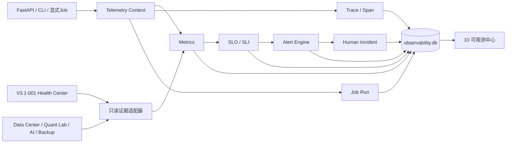

# PANGU-V3.1-002 Observability Platform

## 1. 定位

Observability Platform 是 PANGU-V3.1-001 工程稳定层上的连续运行证据中心：Health Center 继续负责“当前健康快照”，Observability 负责指标、Trace、Job、SLO、告警、Incident 与历史关联。它不拥有任何投资业务状态。



固定边界：

```text
can_trade=false
can_create_orders=false
can_modify_strategy=false
can_modify_risk=false
can_auto_remediate=false
```

## 2. Telemetry 合同

关联字段包括 `trace_id`、`span_id`、`parent_span_id`、`request_id`、`job_id`、`run_id`、`research_run_id`、`experiment_id`、`report_id`、`backup_id` 和 `operation_id`。上下文通过 `contextvars` 传播，不使用全局可变对象。

指标支持 `COUNTER/GAUGE/HISTOGRAM/DURATION/STATUS`，标签仅允许稳定白名单。API 只记录 operationId、方法、状态分类和时延；不保存 URL 参数、请求正文、Authorization、Cookie、Prompt或密钥。

## 3. 数据库 Schema / Migration

数据库：`output/observability.db`，Schema：`pangu-observability-db-v1.0.0`，`PRAGMA user_version=1`，WAL、foreign_keys、busy_timeout。

| 表 | 责任 |
|---|---|
| `schema_meta` | Schema版本 |
| `metric_samples` / `metric_rollups` | 原始指标与聚合 |
| `traces` / `spans` | 请求和服务链路 |
| `job_runs` | 强状态机、幂等作业历史 |
| `slo_definitions` / `slo_evaluations` | 配置和不可变评估 |
| `alerts` / `alert_events` / `alert_trigger_state` | 去重、连续触发、ACK/恢复/抑制 |
| `incidents` / `incident_links` | 人工Incident与证据链接 |
| `observability_snapshots` | Health Center原因快照 |
| `retention_runs` | 先计划后执行的清理审计 |

所有可变治理表都以数据库CHECK锁死交易、订单和自动修复能力。金额、权益、收益、仓位等投资事实不复制到本库。

## 4. Metrics Dictionary

| Metric | Type | Unit | Source |
|---|---|---|---|
| `api.request.count` | COUNTER | count | FastAPI middleware |
| `api.request.duration` | DURATION | ms | FastAPI middleware |
| `api.request.success` | STATUS | ratio | FastAPI middleware |
| `api.request.server_error` | COUNTER | count | FastAPI middleware |
| `api.request.concurrent` | GAUGE | count | FastAPI middleware |
| `api.local_write.rejected` | COUNTER | count | local write protection |
| `engineering.health.score` | GAUGE | score | Health Center |
| `data.health.score` | GAUGE | score | Health Center |
| `data.intelligence.health.score` | GAUGE | score | Data Intelligence审计库 |
| `data.intelligence.incident.count` | GAUGE | count | Data Intelligence审计库 |
| `data.verified.run.count` | GAUGE | count | Data Center catalog |
| `database.quick_check.success` | STATUS | ratio | Health Center |
| `database.file.count` / `database.file.size` | GAUGE | count / bytes | Health Center |
| `backup.verification.success` | STATUS | ratio | Backup audit |
| `quant.artifact.invalid.count` | GAUGE | count | Quant Lab只读扫描 |
| `ai.explicit.success` | STATUS | ratio | 既有AI显式任务审计 |
| `job.run.success` | STATUS | ratio | Job Monitor |
| `job.started/completed/failed/blocked` | COUNTER | count | Job Monitor |
| `job.duration` / `job.retry.count` | DURATION / GAUGE | seconds / count | Job Monitor |

AI指标只允许从已有显式任务审计读取；平台不会主动调用模型。

## 5. SLO Catalog

配置在 `config/observability.yaml`：API成功率、API p95、Data Intelligence健康分、Data Center已验证run、SQLite quick_check、备份时效、显式AI成功率和可观测评估作业成功率。样本未达到 `minimum_samples` 返回 `INSUFFICIENT_DATA`；AI未启用且无调用返回 `NOT_APPLICABLE`。

## 6. Alert Rule Catalog

第一版包含 Data Intelligence异常、正式研究缺失、latest过期、SQLite quick_check、lock/busy、备份、Job心跳、API错误/时延、Quant artifact、策略版本漂移、显式AI失败和Engineering UNHEALTHY共12条规则。相同根因通过fingerprint合并；支持连续触发、冷却、ACK、抑制和恢复。规则只给出人工建议，不注册修复回调。

## 7. Incident 与 Retention

Incident必须由用户显式创建；本版本配置关闭自动创建CRITICAL Incident。生命周期为 `OPEN→INVESTIGATING/MITIGATED→RESOLVED→CLOSED`，版本号实现并发冲突检测，CLOSED不可重开或删除。

Retention默认原始指标30天、rollup 180天、Trace 30天、告警和Incident长期保留。执行前必须保存计划与hash；Incident引用的Trace永不清理。Retention只操作 `observability.db`，绝不扫描或清理 Data Center、Quant Lab、模拟交易账本或备份。

## 8. API 与网页

新增14个API操作：Dashboard、Metrics、Trace列表/详情、Jobs、Alerts/ACK、Incidents创建/状态、SLO、显式评估、Retention计划/执行；项目OpenAPI现有135个operation。写接口继续经过loopback、Origin和`X-Ashare-Client`保护，移动JWT/LAN不能访问桌面API。

“10 可观测中心”只展示服务端事实：总体状态、活动告警、SLO、Job、API指标、Trace、Incident和Retention。浏览器不计算p95/SLO/健康分，所有调用来自OpenAPI生成客户端。

## 9. CLI

```powershell
python engineering_ops.py observability
python engineering_ops.py observe
python engineering_ops.py alerts
python engineering_ops.py incidents
python engineering_ops.py trace --trace-id <id>
python engineering_ops.py retention-plan
python engineering_ops.py ack-alert --alert-id <id>
python engineering_ops.py incident-status --incident-id <id> --status INVESTIGATING --expected-version 1 --note "开始调查"
python engineering_ops.py retention-run --retention-id <id> --plan-hash <sha256>
```

## 10. 已知限制

- API Trace以本地单进程SQLite为存储，不是分布式追踪协议或远程collector；
- 中间件故障采取fail-open，业务响应优先，故障本身需由后续Health/日志发现；
- 只读适配器基于现有持久化证据，缺少正式run时保持证据不足；
- Daily Investment OS的Scheduler/CLI/Web显式作业已通过可选fail-open适配记录统一Job合同；其他更早的历史入口仍需按相同方式逐个接入；
- 正式研究截止日v1仅按Asia/Shanghai工作日和本地16:00判断，尚未直接复用交易所节假日日历；规则等级为WARNING，不会在非交易时段制造CRITICAL；
- `observability.db`首次实机验证后曾被外部进程/文件系统锁定；SQLite副本`quick_check=ok`且305项测试通过，但锁本身应保留为可观测环境事件，不应被掩盖或自动删除；
- Retention v1只删除原始Metric与未引用Trace；告警和Incident长期保留。
