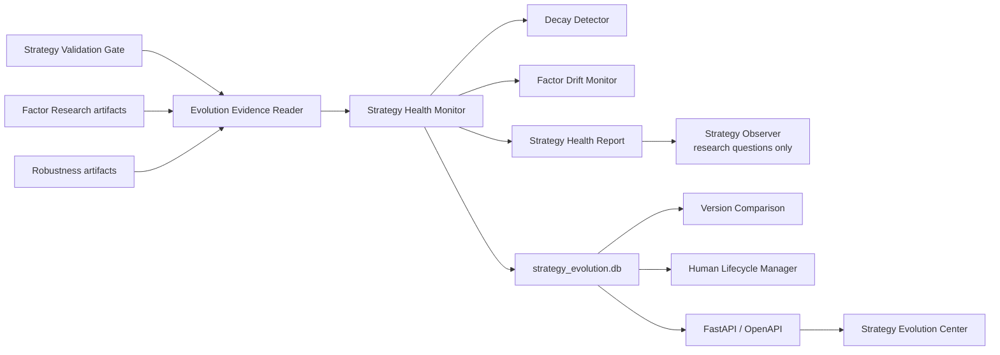

# Strategy Evolution Engine

## Purpose

PANGU‑V3‑002 adds an evidence-only strategy health and research-governance layer. It observes sealed Strategy Validation, Factor Research and Robustness artifacts, compares immutable strategy versions, and records human lifecycle decisions. It does not run experiments, tune parameters, modify strategies, choose a production winner, or create orders.

## Active architecture



The package is located at `src/ashare_agent/strategy_evolution/`. It does not import the broker, OMS, PaperPortfolio, Portfolio Service, factor model, or ResearchPipeline.

## Health contract

The fixed component weights are:

| Component | Weight |
|---|---:|
| Performance | 25% |
| Risk | 20% |
| Factor health | 25% |
| Execution | 15% |
| Environment evidence | 15% |

Missing components are not renormalized. `coverage` is the sum of weights with available evidence. If coverage is below 60%, the public score is `null` and the status is `INSUFFICIENT_EVIDENCE`; the partial score remains available for audit. The first sealed observation is always `BASELINE_BUILDING` and cannot establish decay.

Strategy decay compares annual return, Sharpe, win rate, mean factor IC/ICIR, maximum drawdown, turnover and cost ratio against a prior sealed observation. Seven named factors—value, quality, growth, momentum, trend, low risk and liquidity—track mean, distribution scale, IC, ICIR and contribution. Findings are diagnostic and cannot modify a factor weight.

## Version and lifecycle governance

A strategy branch stores immutable version, code, parameter, factor and data hashes plus evidence references. Mutable Validation Gate state and later reviews are read as observations and are not included in branch identity.

The lifecycle is strictly sequential:

```text
DRAFT → RESEARCH → VALIDATED → PAPER_RUNNING
      → PRODUCTION_CANDIDATE → DEPRECATED → RETIRED
```

Every transition requires a request and a separate attributable human decision. `AI`, `system`, `agent`, `model`, `scheduler` and similar identities are rejected. `PRODUCTION_CANDIDATE` is a research-governance label only and never enables live or paper execution.

## Persistence and artifacts

`output/strategy_evolution.db` contains six registries:

- `strategy_registry`
- `strategy_health`
- `factor_drift`
- `evolution_reports`
- `strategy_comparisons`
- `lifecycle_requests`

Database `CHECK` constraints fix trading, order creation, strategy mutation, AI experiment launch and automatic transition capabilities to false. Full reports are also written as canonical immutable JSON artifacts under `output/strategy_evolution/artifacts/` with a manifest and completion marker. Reads verify database and artifact hashes.

## API and UI

The local API exposes 11 Strategy Evolution operations under `/api/v1/strategy-evolution`. GET operations are passive reads. POST operations require the existing loopback, Origin and `X-Ashare-Client` protection and can only import immutable identities, create health/comparison evidence, or submit/decide human governance requests.

The desktop Strategy Evolution Center displays branch health, fixed component scores, seven-factor drift, version comparisons, lifecycle requests, Strategy Observer output and verified reports. It uses only `web/generated/client.js`; no handwritten API path or frontend strategy calculation exists.

## Safety invariants

- `can_trade=false`
- `can_create_orders=false`
- `can_modify_strategy=false`
- `can_modify_parameters=false`
- `can_modify_factor_weights=false`
- `can_replace_production_strategy=false`
- `can_auto_transition=false`
- `can_launch_experiment=false`

This subsystem monitors research evidence. It is not a self-modifying strategy engine and does not establish future profitability.
